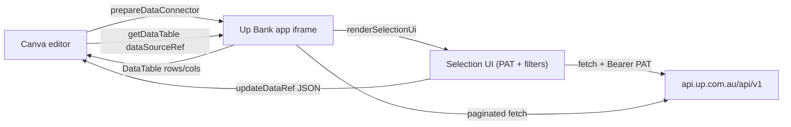

# Up Bank Canva Data Connector

A [Canva Data Connector](https://www.canva.dev/docs/apps/intents/data-connector/) that imports [Up Bank](https://up.com.au) transactions and account balances into Canva designs as refreshable data tables.

> Built for fun as a private Canva app. Your Up Personal Access Token never leaves the browser, no backend involved.

## What it does

- **Transactions** — filter by account, date range, status, category and tag; import matching transactions with columns `Date`, `Description`, `Amount (AUD)`, `Status`, `Category`, `Account`, `Tags`, `Message`, `Foreign Amount`.
- **Accounts** — import a snapshot of every Up account with `Name`, `Type`, `Ownership`, `Balance (AUD)`, `Currency`, `Created at`.

Once imported, the data is a normal Canva data table: Canva chart blocks can render it, and Canva's "Refresh" button re-runs `getDataTable` against the same filter set.

## Architecture



- **Auth.** The user's Up [Personal Access Token](https://api.up.com.au) is pasted once and cached in browser `localStorage` (`up.pat`). All requests go directly to `api.up.com.au` over HTTPS — there is no backend service.
- **CORS.** `api.up.com.au` returns `access-control-allow-origin: *` and allows the `authorization` header, so the iframe can call it directly with no proxy.
- **Pagination.** `listTransactions` follows `links.next` cursors with `page[size]=100` until either the page sequence ends or Canva's `request.limit.row` cap is reached. Transactions are returned newest-first.
- **Row cap.** Canva sends `request.limit.row` (currently 100 in the data connector intent). The app honors it and surfaces `metadata.description` like _"Showing 100 transactions (more were available)"_ when truncated.

## Source layout

```
src/
  api/up.ts                            Typed Up client: ping, listAccounts, listTransactions,
                                       listCategories, listTags + cursor pagination
  auth/patStore.ts                     localStorage get/set/clear for the PAT
  components/PatSetup.tsx              Paste-token-and-verify screen (calls /util/ping)
  components/SelectionUi.tsx           Mode toggle (Transactions / Accounts) and filter form
  data/buildTable.ts                   Up resources -> Canva DataTable (cells, AUD formatting)
  dataSourceRef.ts                     JSON encode/decode for DataSourceRef.source
  intents/data_connector/index.tsx     prepareDataConnector wiring + error mapping
  index.tsx                            Entry; calls prepareDataConnector(dataConnector)
```

The Canva intent is wired through `getDataTable` and `renderSelectionUi`, with errors mapped per the [implementation guide](https://www.canva.dev/docs/apps/intents/data-connector/implementation-guide/):

| Up condition                          | Returned status         |
| ------------------------------------- | ----------------------- |
| Token rejected (HTTP 401)             | `app_error` with prompt |
| Filtered category/tag missing (404)   | `outdated_source_ref`   |
| Network failure or HTTP 5xx           | `remote_request_failed` |
| Anything else                         | `app_error` (sanitized) |

## Prerequisites

- Node `^22 || ^24` and npm 10+. The included [.nvmrc](.nvmrc) will pick the right version with `nvm install`.
- A Canva account.
- The [Canva CLI](https://www.npmjs.com/package/@canva/cli): `npm install -g @canva/cli@latest && canva login`.
- An Up Bank account. To get a Personal Access Token: open the Up app, swipe right → **Data sharing** → **Personal Access Token** → **Generate a token**. (Or visit <https://api.up.com.au>.)

## Run it locally

```bash
npm install
npm start
```

That prints a Development URL (default `http://localhost:8080`).

In the [Canva Developer Portal](https://www.canva.com/developers/apps), either:

- Create a new private app with the **Data Connector** intent enabled, then set its **App source → Development URL** to the URL above; or
- Run `canva apps link` from the project root to link the local checkout to an existing Canva app and write `CANVA_APP_ID` / `CANVA_APP_ORIGIN` into `.env`.

Click **Preview** in the Developer Portal. The app loads in the side panel of a fresh Canva design. Paste your PAT, pick filters, click **Preview transactions** (or **Import account balances**), then **Add to design**.

### Environment variables (`.env`)

```env
CANVA_FRONTEND_PORT=8080
CANVA_APP_ID=AAH...           # from Developer Portal
CANVA_APP_ORIGIN=https://app-...canva-apps.com   # also from Developer Portal -> Settings -> Security
CANVA_HMR_ENABLED=TRUE        # enables hot module reload while previewing
```

## Scripts

```bash
npm start          # webpack dev server with HMR
npm run build      # production bundle into dist/ + extract i18n strings
npm run lint       # ESLint (Canva preset, with i18n description rules relaxed)
npm run lint:types # tsc --noEmit
npm test           # Jest
```

## Out of scope

The following Up API surfaces are intentionally not implemented (PRs welcome):

- Webhooks (`/webhooks`) — would need a backend to receive events.
- Attachments (`/attachments`).
- Mutations: categorize transaction, add/remove tags.
- Multi-user / public distribution. The current PAT-in-localStorage design only fits a private/single-user app.

## Aggregations (next-step idea)

Because Canva caps a single import at `limit.row` rows (100 today), raw transaction history beyond that is truncated. If you want a year-at-a-glance dashboard in Canva, the more useful direction is a "group by" mode — for example, one row per `(category, month)` with summed amount. The shape is a much better fit for Canva's chart blocks too. Easy to add in `buildTable.ts` and a `SegmentedControl` in `SelectionUi.tsx`; not implemented yet.

## Acknowledgements

- Built on the official [Canva Apps SDK Data Connector template](https://www.canva.dev/docs/apps/app-templates/data-connector/). The `scripts/`, `webpack.config.ts`, `jest.*`, `styles/`, `declarations/` and `.prettierrc` files come from that template largely unchanged.
- Up Banking API: <https://developer.up.com.au>.
- Inspired by Voislav Dimitrijevikj's "How to Build a Canva App with Cursor + Claude" internal guide.

## License

MIT — see [LICENSE](LICENSE).

The bundled Canva SDK packages (`@canva/*` in `node_modules`) are subject to their own licenses, included in those packages.
